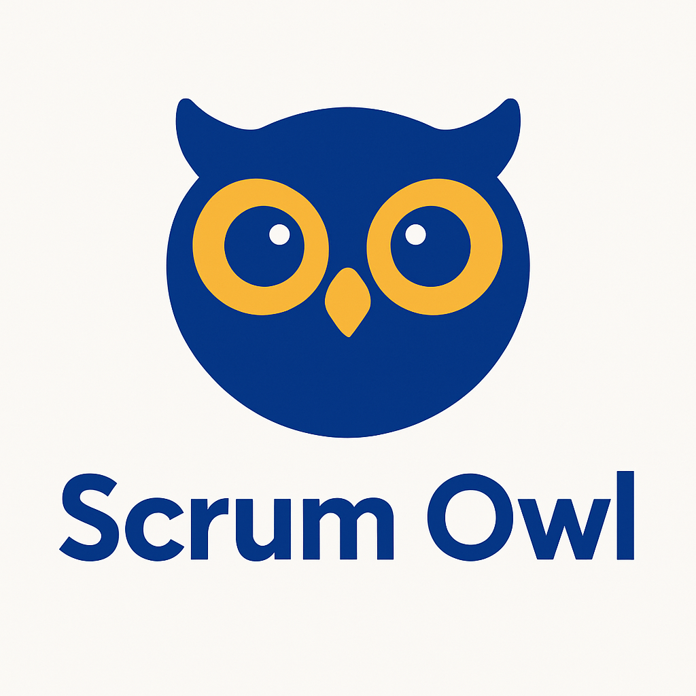

# Scrum Owl Discord Bot

A Discord bot that facilitates Planning Poker sessions for agile teams. Built with TypeScript and discord.js.

## Features

- Planning Poker: Estimate tasks with team voting
- Facilitator Selection: Randomly select a facilitator
- Reminders: Set one-time or recurring reminders
- Burndown Charts: Track sprint progress with visual burndown charts

## Setup

### Prerequisites

- Node.js (v16.9.0+)
- Discord account and server

### Quick Start

1. Clone and install:

   ```
   git clone <repository-url>
   cd scrum-owl
   npm install
   ```

2. Create a Discord bot in the [Developer Portal](https://discord.com/developers/applications)
    - Enable SERVER MEMBERS INTENT and MESSAGE CONTENT INTENT
    - Copy the bot token

3. Configure environment:

   ```
   # .env file
   DISCORD_TOKEN=your_discord_bot_token
   CLIENT_ID=your_client_id
   GUILD_ID=your_guild_id
   ```

4. Deploy and start:
   ```
   npm run build
   npm run deploy
   npm start
   ```

### Docker Deployment

```
cp .env.example .env
# Edit .env with your values
docker-compose up -d
```

## Commands

### Planning Poker

```
/poker description: [item to estimate]
```

### Facilitator Selection

```
/facilitator participants: [comma-separated names]
```

### Reminders

Create, manage, and delete reminders.

#### Creating Reminders

```
/reminder create title: [title] message: [message] time: [time] type: [once|daily] [channel: #channel]
```

**Required Parameters:**
- `title`: Title of the reminder
- `message`: Message content of the reminder
- `time`: Execution time (e.g., "14:30", "2h", "2024-07-15 14:30")
- `type`: Type of reminder (`once`: one-time, `daily`: daily repeating)

**Optional Parameters:**
- `channel`: Destination channel for the reminder (defaults to current channel)
- `skip_weekends`: Skip weekends for daily reminders (true/false)
- `end_date`: End date (YYYY-MM-DD format)

**Usage Examples:**
```
# One-time reminder in current channel
/reminder create title: "Meeting" message: "Team meeting is starting" time: "14:30" type: once

# Daily reminder in specific channel
/reminder create title: "Daily Report" message: "Time to write daily report" time: "17:00" type: daily channel: #general

# Skip weekends reminder in specific channel
/reminder create title: "Stand-up" message: "Stand-up meeting time" time: "09:00" type: daily skip_weekends: true channel: #dev-team

# One-time reminder in different channel
/reminder create title: "Deployment" message: "Production deployment starting" time: "2h" type: once channel: #alerts
```

#### Listing Reminders

```
/reminder list
```

Displays a list of reminders you have created.

#### Deleting Reminders

```
/reminder delete id: [reminder_id]
```

Deletes the reminder with the specified ID.

#### Editing Reminders

```
/reminder edit id: [reminder_id] [title: new_title] [message: new_message] [time: new_time] [active: true/false]
```

Edits an existing reminder. All parameters are optional.

### Burndown Charts

Create and manage burndown charts to track sprint progress visually.

#### Creating Burndown Charts

```
/burndown create title: [title] total_points: [points] start_date: [YYYY-MM-DD] end_date: [YYYY-MM-DD] [channel: #channel]
```

**Required Parameters:**
- `title`: Title of the burndown chart
- `total_points`: Total story points for the sprint (must be greater than 0)
- `start_date`: Sprint start date in YYYY-MM-DD format
- `end_date`: Sprint end date in YYYY-MM-DD format (must be after start date)

**Optional Parameters:**
- `channel`: Channel for the burndown chart (defaults to current channel)

**Usage Examples:**
```
# Create a burndown chart in current channel
/burndown create title: "Sprint 1" total_points: 100 start_date: "2024-01-01" end_date: "2024-01-14"

# Create a burndown chart in specific channel
/burndown create title: "Sprint 2" total_points: 80 start_date: "2024-01-15" end_date: "2024-01-28" channel: #dev-team
```

#### Updating Progress

```
/burndown update chart_id: [chart_id] points_burned: [points] [note: "progress note"]
```

Updates the progress on a burndown chart by burning down story points.

**Usage Examples:**
```
# Update progress without note
/burndown update chart_id: "abc123" points_burned: 15

# Update progress with note
/burndown update chart_id: "abc123" points_burned: 20 note: "Completed user stories 1-3"
```

#### Viewing Burndown Charts

```
/burndown view chart_id: [chart_id]
```

Displays detailed information about a specific burndown chart including progress bar and recent entries.

#### Listing Burndown Charts

```
/burndown list
```

Displays a list of all your burndown charts with their current progress.

#### Deleting Burndown Charts

```
/burndown delete chart_id: [chart_id]
```

Deletes a burndown chart. You can only delete charts you created.

## Development

Source code is in the `src` directory. To add a new command:

1. Create a file in `src/commands/`
2. Implement the `Command` interface
3. Run `npm run deploy`

## License

ISC
